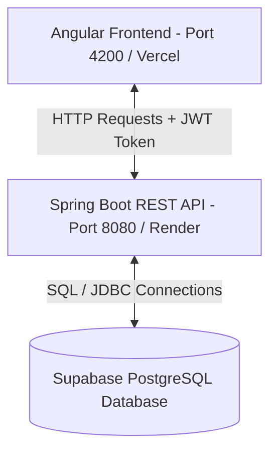
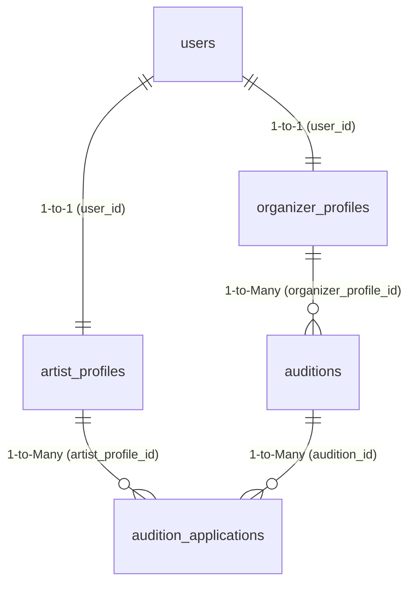

# TalentHub - Audition & Talent Matching Platform

> [!NOTE]
> **Quick Access & URLs**
> *   **Local Frontend UI:** http://localhost:4200
> *   **Local Backend API:** http://localhost:8080/api/v1
> *   **Deployed Backend API (Render):** https://talenthub-aan4.onrender.com/api/v1
> *   **Supabase Project Dashboard:** https://jtvktifhnuwgrkclrknq.supabase.co
> *   **Database Host:** `db.jtvktifhnuwgrkclrknq.supabase.co` (Port `5432` / Pooler `aws-0-ap-northeast-1.pooler.supabase.com`)
> *   **Database User / Password:** `postgres` / `Talent@42311#`

---

## 1. System Architecture & Request Flow

TalentHub is built using a **decoupled Client-Server Architecture** (Frontend & Backend are hosted independently):

### End-to-End Data Flow Example (Login & Requesting Data):
1. **User Login:** The user enters credentials in the Angular interface. Angular sends a `POST` request to `/api/v1/auth/login`.
2. **Authentication:** Spring Boot receives the credentials, validates them against the database using **BCrypt** hashing, generates a **JWT (JSON Web Token)**, and returns it to Angular.
3. **Session Management:** Angular saves the JWT token in `localStorage`.
4. **Authorized Requests:** For subsequent actions (e.g., creating an audition), Angular attaches the JWT token to the `Authorization` header (`Bearer <token>`). Spring Boot decrypts the token, validates the role, handles the request, and connects to **Supabase PostgreSQL** via **Spring Data JPA** to save or fetch data.

---

## 2. Database Schema (Entity Relationships)

Here is the database structure automatically constructed by Hibernate from our entities:

### Table Definitions

#### A. `users` (Authentication & Identity)
*   `id` (BIGSERIAL, Primary Key)
*   `email` (VARCHAR, Unique) - User's login ID.
*   `password` (VARCHAR) - Hashed using BCrypt.
*   `role` (VARCHAR) - Defines user access: `ARTIST`, `ORGANIZER`, or `ADMIN`.
*   `created_at` / `updated_at` (TIMESTAMP)

#### B. `artist_profiles`
*   `id` (BIGSERIAL, Primary Key)
*   `user_id` (BIGINT, Foreign Key referencing `users.id`, Unique)
*   `bio` (TEXT) - Artist's description.
*   `phone` (VARCHAR)
*   `location` (VARCHAR)
*   `experience` (TEXT) - List of past roles/works.
*   `profile_image_url` (VARCHAR)

#### C. `organizer_profiles`
*   `id` (BIGSERIAL, Primary Key)
*   `user_id` (BIGINT, Foreign Key referencing `users.id`, Unique)
*   `organization_name` (VARCHAR, Not Null)
*   `description` (TEXT)
*   `location` (VARCHAR)
*   `website` (VARCHAR)

#### E. `auditions` (Audition Postings)
*   `id` (BIGSERIAL, Primary Key)
*   `organizer_profile_id` (BIGINT, Foreign Key referencing `organizer_profiles.id`)
*   `title` (VARCHAR)
*   `description` (TEXT)
*   `requirements` (TEXT)
*   `category` (VARCHAR) - e.g., Acting, Singing, Dancing.
*   `location` (VARCHAR)
*   `audition_date` (DATE)
*   `application_deadline` (DATE)
*   `status` (VARCHAR) - `ACTIVE` or `INACTIVE`.

#### F. `audition_applications` (Applications Link Table)
*   `id` (BIGSERIAL, Primary Key)
*   `audition_id` (BIGINT, Foreign Key referencing `auditions.id`)
*   `artist_profile_id` (BIGINT, Foreign Key referencing `artist_profiles.id`)
*   `message` (TEXT) - Optional cover note from the artist.
*   `status` (VARCHAR) - Current state: `PENDING`, `SHORTLISTED`, `REJECTED`, `SELECTED`.
*   `applied_at` (TIMESTAMP)
*   **Unique Constraint:** `(audition_id, artist_profile_id)` - Prevents an artist from applying multiple times to the same audition.

---

## 3. JWT Security & Hashing Flow

Spring Security acts as a **gatekeeper** to intercept all requests:

1. **Password Safety:** When a user registers, their raw password is run through the **BCryptPasswordEncoder** before database insertion. Raw passwords are *never* stored.
2. **JWT Filter (`JwtAuthenticationFilter`):** Every API request is intercepted. The filter looks at the `Authorization` header.
3. **Verification:**
   * If the JWT is valid and has not expired, the user's details and role are loaded into the Spring Security Context (`SecurityContextHolder`).
   * If the JWT is missing or invalid, the API returns `401 Unauthorized` or `403 Forbidden`.
4. **Role-Based Authorization:** Controller endpoints are protected using `@PreAuthorize("hasRole('ORGANIZER')")` or `@PreAuthorize("hasRole('ARTIST')")` to prevent cross-role operations.

---

## 4. Key Project Files

### Backend (Spring Boot)
*   [`JwtTokenProvider.java`](file:///d:/proj/TalentHub/backend/src/main/java/com/talenthub/security/JwtTokenProvider.java): Deals with encoding, decoding, generating, and validating JWT tokens.
*   [`SecurityConfig.java`](file:///d:/proj/TalentHub/backend/src/main/java/com/talenthub/config/SecurityConfig.java): Configures password hashing, CORS permissions, session management, and defines which endpoints are public/private.
*   [`AuditionController.java`](file:///d:/proj/TalentHub/backend/src/main/java/com/talenthub/controller/AuditionController.java) & [`AuditionApplicationController.java`](file:///d:/proj/TalentHub/backend/src/main/java/com/talenthub/controller/AuditionApplicationController.java): Handles HTTP mappings for CRUD operations on auditions and application processing.

### Frontend (Angular)
*   [`auth.service.ts`](file:///d:/proj/TalentHub/frontend/src/app/core/services/auth.service.ts): Handles logins, registration, saving JWT, and logout functionality.
*   [`jwt.interceptor.ts`](file:///d:/proj/TalentHub/frontend/src/app/core/interceptors/jwt.interceptor.ts): Intercepts all outgoing HTTP requests and automatically appends the JWT bearer token header.
*   [`role.guard.ts`](file:///d:/proj/TalentHub/frontend/src/app/core/guards/role.guard.ts): Restricts Angular routing access (guards paths so artists cannot access organizer pages).

---

## 5. Polytechnic Project Presentation Q&A Guide

Prepare for these common questions during your viva/presentation:

### Q1: Why did you choose JWT over Session Cookies?
*   **Answer:** *"Because JWT is stateless. With cookies, the server has to store session data in memory or a database to validate requests. With JWT, the server is completely stateless. Once the server generates a token, it signs it with a secret key. In future requests, the server simply decrypts the token to verify the user identity, reducing server resource usage and making it easily scalable."*

### Q2: How are passwords secured in your database?
*   **Answer:** *"We use BCrypt hashing. It is a salt-based encryption algorithm. Salting prevents 'rainbow table attacks' (where hackers match pre-computed hashes), and the slowness of BCrypt makes brute-force attacks computationally infeasible."*

### Q3: What is JPA / Hibernate?
*   **Answer:** *"Java Persistence API (JPA) is a specification for Object-Relational Mapping (ORM) in Java. Hibernate is the provider/implementation we use. It allows us to interact with our PostgreSQL database using Java objects (Entities) rather than writing raw SQL insert/update statements, making our code clean and database-independent."*

### Q4: How do you handle CORS (Cross-Origin Resource Sharing)?
*   **Answer:** *"Since our Angular frontend runs on port 4200 (or Vercel) and our Spring Boot backend runs on port 8080 (or Render), browsers block cross-origin requests by default for safety. We configured Spring Security to allow requests originating from our frontend URL using the `@CrossOrigin` annotation and `CorsConfigurationSource` settings in `SecurityConfig.java`."*

### Q5: What is the purpose of the JWT Interceptor in Angular?
*   **Answer:** *"It intercepts every outgoing Angular `HttpClient` request and automatically adds the HTTP header `Authorization: Bearer <JWT_token>` if the user is logged in. This saves us from having to manually append the auth token code in every individual service method."*
